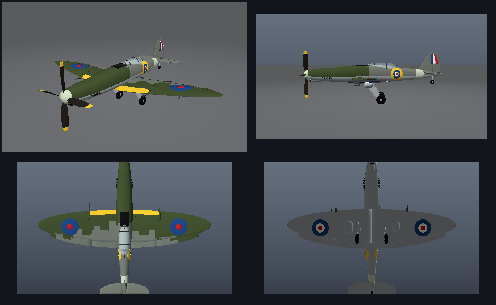

# 3D — каталог процедурных 3D-моделей

Коллекция полностью процедурных 3D-моделей (генерация кодом на Python,
только стандартная библиотека — без Blender/CAD «руками»).
Каждая модель лежит в своей папке со своим генератором, вьюером и рендерами.

## Каталог

| Модель | Описание | Подробнее |
|--------|----------|-----------|
| **Supermarine Spitfire Mk I** | Истребитель RAF, «Битва за Британию»: камуфляж «A» (Dark Green / Dark Earth / Sky), 8× Browning, винт Rotol, шасси. Форматы: OBJ+MTL, GLB (PBR), STL. | [spitfire/README.md](spitfire/README.md) |
| **Supermarine Spitfire Mk IX** | Истребитель RAF, 1943–44: Merlin 61, удлинённый нос, 4-лопастный винт, крыло C (2× Hispano + 4× Browning), камуфляж Ocean Grey / Dark Green + Sea Grey. Форматы: OBJ+MTL, GLB (PBR), STL. | [spitfire-mk-ix/README.md](spitfire-mk-ix/README.md) |

## Spitfire Mk I

[](spitfire/README.md)

* **Папка:** [`spitfire/`](spitfire/) — [`models/`](spitfire/models), [`renders/`](spitfire/renders), [`tools/`](spitfire/tools), [`viewer/`](spitfire/viewer), [`serve.py`](spitfire/serve.py)
* **Документация:** [spitfire/README.md](spitfire/README.md) — габариты, устройство модели, параметры генератора
* **Интерактивный просмотр:**

```bash
cd spitfire
python3 serve.py            # http://localhost:8000
```

* **Пересборка из кода:**

```bash
cd spitfire
python3 tools/generate_spitfire.py     # models/*.obj .glb .stl
python3 tools/make_renders.py          # renders/*.png
```

* **Форматы:** `models/spitfire.obj` (+`.mtl`) — Blender/Sketchfab, `models/spitfire.glb` — Three.js/Unity/Godot/AR, `models/spitfire.stl` — 3D-печать.

## Spitfire Mk IX

[](spitfire-mk-ix/README.md)

* **Папка:** [`spitfire-mk-ix/`](spitfire-mk-ix/) — [`models/`](spitfire-mk-ix/models), [`renders/`](spitfire-mk-ix/renders), [`tools/`](spitfire-mk-ix/tools), [`viewer/`](spitfire-mk-ix/viewer), [`serve.py`](spitfire-mk-ix/serve.py)
* **Документация:** [spitfire-mk-ix/README.md](spitfire-mk-ix/README.md) — габариты, отличия от Mk I, параметры генератора
* **Интерактивный просмотр:**

```bash
cd spitfire-mk-ix
python3 serve.py            # http://localhost:8000
```

* **Пересборка из кода:**

```bash
cd spitfire-mk-ix
python3 tools/generate_spitfire.py     # models/*.obj .glb .stl
python3 tools/make_renders.py          # renders/*.png
```

* **Форматы:** `models/spitfire.obj` (+`.mtl`) — Blender/Sketchfab, `models/spitfire.glb` — Three.js/Unity/Godot/AR, `models/spitfire.stl` — 3D-печать.
