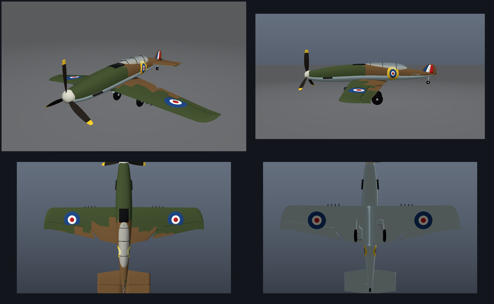

# Supermarine Spitfire Mk I — процедурная 3D-модель

Полностью процедурная (сгенерированная кодом) 3D-модель истребителя
**Supermarine Spitfire Mk I** в окраске RAF периода «Битвы за Британию»:
схема камуфляжа **«A»** (Dark Green + Dark Earth сверху, Sky/Duck-Egg снизу),
8 пулемётов Browning в крыле, трёхлопастной винт Rotol, убранное/выпущенное шасси.

Модель построена **без внешних зависимостей** — только стандартная библиотека
Python. Никаких CAD/Blender-файлов «руками»: всё считается формулами
(профили NACA, суперэллипсы сечений, лофтинг оболочек).



---

## Быстрый старт

**Посмотреть в браузере (интерактивно, с вращением и подсветкой):**

```bash
cd spitfire
python3 serve.py            # http://localhost:8000
```

**Пересобрать модель из «исходников» (кода):**

```bash
python3 tools/generate_spitfire.py     # models/*.obj .glb .stl
python3 tools/make_renders.py          # renders/*.png (оффлайн-рендер, без браузера)
```

**Открыть в редакторе:** `models/spitfire.obj` (+ `spitfire.mtl`) — Blender,
3ds Max, Maya, Cinema 4D, Sketchfab. В Blender: *File → Import → Wavefront (.obj)*.
Для веба/игр удобнее `models/spitfire.glb` (glTF 2.0 binary, PBR-материалы).

**3D-печать:** `models/spitfire.stl` (единый меш, метры; масштаб ×100 → сантиметры).
Для печати модель лучше разрезать на части: крыло и фюзеляж — отдельные оболочки.

---

## Что лежит в папке

| Путь | Что это |
|------|---------|
| `tools/meshkit.py` | мини-библиотека: меш, лофтинг, ориентация нормалей, экспорт OBJ/GLB/STL |
| `tools/generate_spitfire.py` | **генератор модели** — вся геометрия и раскраска |
| `tools/render_preview.py` | софтверный растеризатор (z-буфер, свет, блики) → PNG |
| `tools/make_renders.py` | финальные превью + контактный лист |
| `models/spitfire.obj` + `.mtl` | универсальный формат (Blender, Sketchfab, печать) |
| `models/spitfire.glb` | glTF 2.0 binary, PBR — Three.js / Unity / Godot / AR |
| `models/spitfire.stl` | только геометрия, для 3D-печати |
| `models/materials.json` | палитра (sRGB, metallic, roughness) для проверки/переноса |
| `viewer/index.html` | интерактивный вьюер (Three.js, орбитальная камера, свет, каркас) |
| `viewer/vendor/**` | three.js r160 + GLTFLoader/OrbitControls (MIT), локально, без CDN |
| `serve.py` | мини-сервер для вьюера (только stdlib) |
| `renders/*.png` | готовые превью (см. ниже) |

Готовые превью: `01_hero`, `02_side`, `03_top`, `04_front`, `05_bottom`,
`06_engine`, `07_cockpit`, `08_tail`, `model_sheet`.

---

## Соответствие прототипу

| Параметр | Модель | Прототип (Mk I) |
|----------|--------|-----------------|
| Размах крыла | 11,23 м | 11,23 м |
| Длина | 9,12 м | 9,12 м |
| Площадь крыла | 22,5 м² | 22,48 м² |
| Хорда: корень / конец «плоской» части | 2,60 / 1,52 м | ≈2,6 / 1,5 м |
| Поперечное V | 5,5° | 5,5–6° |
| Угол установки крыла | 2,5° → 1,0° | ≈2,5° |
| Профиль | NACA 2213 → 2209 (отн. толщина 13,5 % → 9,8 %) | близко к NACA 2200-й серии |
| Винт | Rotol, 3 лопасти, ⌀3,50 м | Rotol ⌀3,50 м |
| Вооружение | 8 × Browning .303 в крыле | 8 × .303 (Mk I, вариант B) |
| Форма крыла | эллипс: задняя кромка прямая, носок закруглён по эллипсу | эллиптическое крыло Митчелла |
| Камуфляж | схема «A»: Dark Green / Dark Earth + Sky | стандарт RAF с 1938 г. |

Проверки, которые выполняются при генерации (см. вывод `generate_spitfire.py`):
габариты, площадь крыла, а также **контроль ориентации оболочек** — каждая
замкнутая часть проверяется по знаку объёма, поэтому все нормали смотрят наружу,
а модель корректно отображается при одностороннем рендеринге и в 3D-печати.

---

## Как устроена модель

* **Фюзеляж** — лофт по 26 сечениям; сечение — суперэллипс (плоская «палуба»
  сверху и скруглённый низ), полуширина до 1,07 м, полувысота до 0,60 м.
* **Крыло** — 15 сечений по размаху: трапеция 2,60→1,52 м до y=5,0 м и
  эллиптическая законцовка до y=5,615 м; поперечное V, крутка, NACA-профиль.
* **Механизация** — элероны (y ≥ 1,98 м, 32 % хорды) и рули высоты вынесены
  отдельными оболочками и заходят под неподвижную часть без щели.
* **Оперение** — стабилизатор с рулём высоты, киль (h = 0,80 м) с рулём
  направления, флажок RAF (синий–белый–красный), посадочный гак под фюзеляжем.
* **Винт** — три лопасти с круткой 40°(комель) → 10°(конец), жёлтые законцовки;
  обтекатель-спиннер Sky.
* **Шасси** — стойки с олео-пневматикой, подкос, тормозная магистраль, щитки,
  колёса ⌀0,75 м с профильным протектором; хвостовое колесо.
* **Детали** — фонарь из плоских панелей с рамами, зеркало, антенная мачта,
  6 выхлопных патрубков на борт, противобликовая полоса, радиатор и
  маслорадиатор под крылом, 8 стволов Browning.
* **Раскраска** — материал выбирается **на грань** по правилу: тег части +
  (x, y, z) центроида. Камуфляж задан непрерывными кривыми границ, поэтому
  переходы цветов не «рвутся» по граням сетки.

Полигонаж: ≈10 тыс. вершин / ≈20,7 тыс. треугольников (квады — в OBJ,
триангуляция — в GLB/STL). Этого достаточно для превью, веба и печати;
для кинематографического рендера модель можно загрузить в Blender и добавить
Subdivision Surface.

---

## Как изменить

Правьте `tools/generate_spitfire.py` и запускайте генератор.

| Что нужно | Где менять |
|-----------|-----------|
| Габариты, хорды, угол V, диаметр винта | `SPEC`, `FUS_RY/FUS_RZ/FUS_ZC` |
| Камуфляж (границы пятен) | `CAMO_BND`, `camo_green_wing()`, `camo_green_fuse()` |
| Цвета | блок `mat(...)` в начале файла |
| Число лопастей винта | `SPEC["prop_blades"]` |
| Убранное шасси | в `build()` вызвать `build_main_gear(mesh, +1, extended=False)` |
| Борта: только левый / зеркало | `mesh.mirror_y(*mark)` в `build()` |
| Оперение, радиаторы | `TAIL`, `build_radiators()`, `FIN_LE/FIN_TE` |

Материалы экспортируются и в `.mtl`, и в glTF-PBR (metallic/roughness),
поэтому окраска одинаково выглядит в Blender и в веб-вьюере.

---

## Технические заметки

* **Система координат модели:** X — вперёд (нос), Y — влево, Z — вверх, метры.
  Начало координат — на оси винта в плоскости симметрии (кончик обтекателя
  винта — x = +5,0; хвост — x = −4,14). В glTF модель лежит в этих же осях,
  вьюер разворачивает её в Y-up (`rotation.x = -π/2`).
* **Форматы:** OBJ пишется только квадами и ссылается на `spitfire.mtl`;
  GLB — собственный минимальный экспортёр (буферы + accessors + PBR-материалы,
  без внешних библиотек); STL — бинарный.
* **Оффлайн-рендер** (`tools/render_preview.py`) — это собственный растеризатор:
  перспективно-корректная интерполяция, z-буфер, ключевой свет + небесная
  подсветка + блик, полупрозрачное стекло фонаря. Он нужен, чтобы проверять
  модель без браузера (например, в CI).
* **Лицензии:** three.js и его аддоны в `viewer/vendor` — MIT
  (© three.js authors). Сгенерированные модель и картинки — используйте свободно.

---

## Ограничения

* Это **визуальная** модель: толщина обшивки, внутренняя структура, кабина
  (приборная доска, кресло, управление) не детализированы.
* Крыло и фюзеляж — отдельные пересекающиеся оболочки (стандартная практика для
  игровых моделей); для аддитивной печати и расчётов CFD требуется булево
  объединение.
* Нет текстур (только цвета материалов), нет UV-развёртки под покраску
  (UV-координаты записаны как заглушки).
* Крутка лопастей винта и некоторые мелкие обводы — художественное приближение
  по фотографиям и обмерным чертежам, а не по заводской документации.
